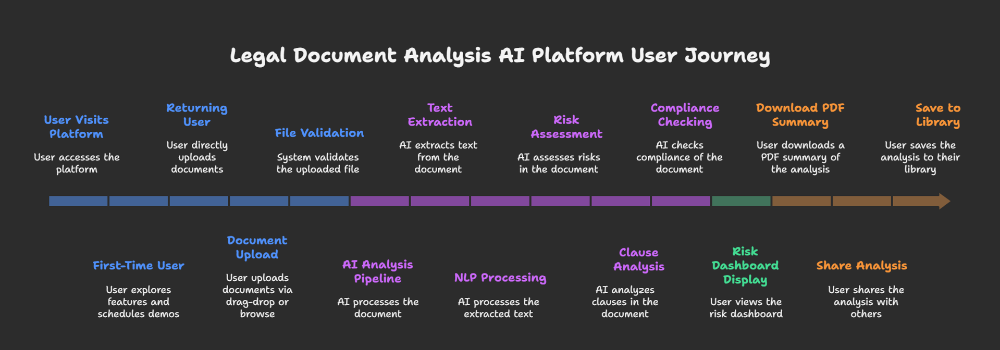
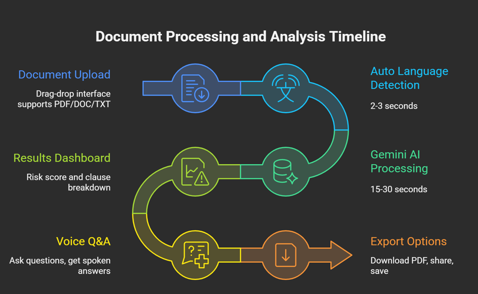
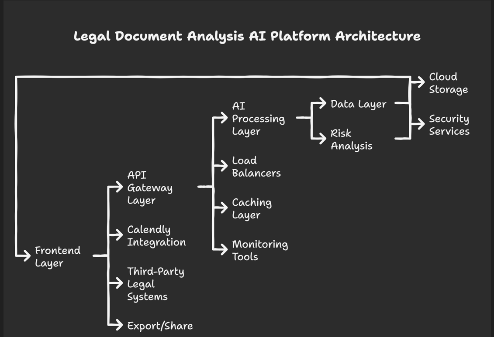
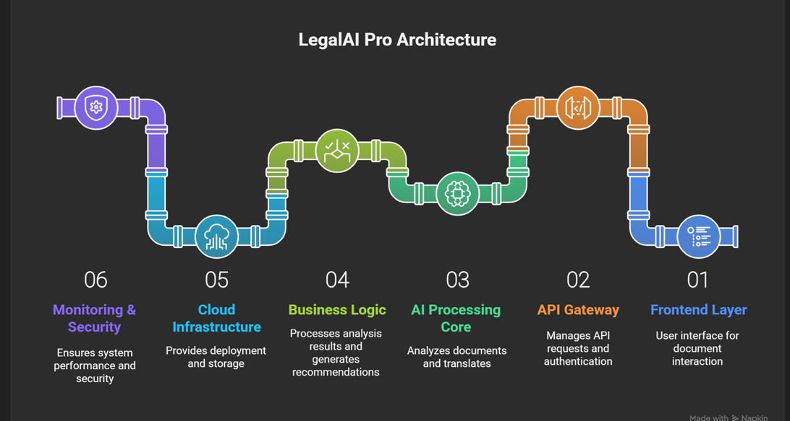

# Legal Document Analysis AI Platform

<p align="center">
  
  
  
  
</p>

<p align="center">
  <strong>Transforming Legal Document Review with Artificial Intelligence</strong>
</p>

<p align="center">
  An advanced AI-powered legal document analysis platform that revolutionizes how legal professionals review, analyze, and manage legal documents through intelligent automation.
</p>

---

## 🎯 Project Overview

The Legal Document Analysis AI Platform combines cutting-edge artificial intelligence with intuitive user experience to deliver faster, more accurate document analysis. Our platform reduces manual review time by up to 80% while maintaining consistent accuracy and comprehensive risk assessment.



### 🌟 Key Features

- 🤖 **AI-Powered Analysis** - Advanced NLP for intelligent document comprehension
- ⚡ **Speed & Efficiency** - 80% reduction in initial review time
- 🎯 **Risk Assessment** - Automated 0-100 risk scoring system
- 📊 **Comprehensive Insights** - Detailed analysis with visual dashboards
- 🔄 **Seamless Integration** - Professional workflow incorporation
- 📱 **Responsive Design** - Mobile-first, accessible interface

## 🚀 Quick Start

### Prerequisites

- Node.js 18.0 or higher
- npm or yarn package manager
- Modern web browser

### Installation

1. **Clone the repository**
   ```bash
   git clone https://github.com/SimranShaikh20/LegalAI-Legal-Document-AI-Assistant.git
   cd legal-document-analysis-ai
   ```

2. **Install dependencies**
   ```bash
   npm install
   # or
   yarn install
   ```

3. **Start development server**
   ```bash
   npm run dev
   # or
   yarn dev
   ```

4. **Open your browser**
   Navigate to `http://localhost:5173`

## 🏗 Architecture Overview

### Project Structure

```
src/
├── components/           # Reusable React components
│   ├── ui/              # Base UI components (shadcn/ui)
│   ├── Hero.tsx         # Landing page hero section
│   ├── Features.tsx     # Platform features showcase
│   ├── DocumentUpload.tsx # Document upload interface
│   └── RiskDashboard.tsx # Analysis results dashboard
├── pages/               # Page components
│   ├── Index.tsx        # Main landing page
│   └── NotFound.tsx     # 404 error page
├── hooks/               # Custom React hooks
├── lib/                 # Utility functions
└── styles/              # Global styles and design tokens
```

### Core Components

#### 🎨 Hero Component
- Responsive hero section with professional styling
- Dynamic typography and gradient backgrounds
- Primary call-to-action for document analysis

#### 📋 Features Component
- Grid-based feature showcase
- Color-coded feature categories
- Integrated Calendly scheduling for demos

#### 📄 DocumentUpload Component
- Drag-and-drop file upload interface
- Support for PDF, DOC, DOCX, TXT formats
- Real-time upload progress indicators

#### 📊 RiskDashboard Component
- Comprehensive risk scoring visualization
- Interactive analysis breakdown
- Export, sharing, and library save functionality



## 🛠 Technology Stack

### Frontend Framework
- **React 18** - Latest React with concurrent features
- **TypeScript** - Type-safe development
- **Vite** - Fast build tool and development server

### Styling & UI
- **Tailwind CSS** - Utility-first CSS framework
- **Radix UI** - Accessible component primitives
- **shadcn/ui** - Pre-built component library
- **Lucide React** - Modern icon library

### State Management & Routing
- **TanStack Query** - Server state management
- **React Router DOM** - Client-side routing
- **React Hooks** - Local component state

## 📊 Platform Capabilities

### Risk Assessment Categories

- **🔒 Contract Terms Analysis**
  - Liability and indemnification clauses
  - Payment terms and conditions
  - Performance obligations

- **⚖️ Compliance Verification**
  - Regulatory requirement adherence
  - Industry standard compliance
  - Legal precedent alignment

- **💰 Financial Risk Assessment**
  - Cost implications and exposures
  - Payment schedule analysis
  - Insurance and bonding requirements

- **🏢 Operational Risk Review**
  - Timeline and delivery requirements
  - Performance metrics and KPIs
  - Dispute resolution mechanisms




### User Workflow

1. **Document Upload** - Drag & drop or browse to select legal documents
2. **AI Analysis** - Automated risk assessment across multiple categories
3. **Results Dashboard** - Comprehensive scoring and visual analytics
4. **Action & Collaboration** - Download reports, share analysis, save to library

## 🎯 Target Audience

- **Legal Professionals** - Lawyers, paralegals, legal assistants
- **Law Firms** - Small to enterprise-level legal practices
- **Corporate Legal Teams** - In-house legal departments
- **Legal Consultants** - Independent legal advisors

## 🚀 Getting Started (User Guide)

### Document Analysis Process

1. **Upload Your Document**
   - Supported formats: PDF, DOC, DOCX, TXT
   - Maximum file size: 50MB
   - Batch processing available

2. **AI Processing**
   - Real-time progress tracking
   - Processing time: 30-120 seconds
   - Automated risk assessment

3. **Review Results**
   - Risk score: 0-100 scale
   - Color-coded indicators
   - Detailed recommendations





### Risk Score Interpretation

- **🟢 0-30: Low Risk** - Minimal legal concerns
- **🟡 31-70: Medium Risk** - Review recommended  
- **🔴 71-100: High Risk** - Immediate attention required

## 🔧 Development

### Available Scripts

```bash
npm run dev          # Start development server
npm run build        # Build for production
npm run preview      # Preview production build
npm run lint         # Run ESLint
npm run type-check   # Run TypeScript checks
```

### Code Quality Standards

- **ESLint** - Code consistency and quality
- **TypeScript** - Type safety and better IDE support
- **Component-driven** - Reusable, modular architecture
- **Responsive Design** - Mobile-first approach

### Performance Optimizations

- **Lazy Loading** - Components loaded on demand
- **Bundle Splitting** - Optimized chunk sizes
- **Image Optimization** - Responsive images
- **Caching Strategy** - Browser caching for static assets

## 🔒 Security & Compliance

### Security Measures
- 🔐 End-to-end encryption for data transmission
- 🛡️ Role-based access controls
- 🔍 Comprehensive audit trails
- 🌐 Enterprise-grade hosting infrastructure

### Compliance Standards
- **GDPR** - European data protection compliance
- **CCPA** - California privacy law adherence
- **SOC 2** - Security and availability standards
- **Legal Industry** - Bar association guidelines

## 🌟 Business Value

### Key Benefits
- **80% Time Reduction** in initial document review
- **Consistent Analysis** across all documents
- **Risk Mitigation** through early issue identification
- **Cost Efficiency** through automation
- **Scalable Processing** for high-volume workflows

### Market Impact
- **$23B** Total addressable market in legal technology
- **180,000+** Law firms in the US market
- **75,000+** Corporate legal departments
- **85%** of legal professionals report document review bottlenecks


## 📄 License

This project is licensed under the MIT License - see the [LICENSE](LICENSE) file for details.

## 🙏 Acknowledgments

Built with modern web technologies and best practices to deliver a professional, scalable solution for the legal industry.

---

<p align="center">
  <strong>Transform your legal document review process with AI-powered analysis</strong><br>
  <em>Delivering 80% time savings, consistent accuracy, and comprehensive risk insights</em>
</p>