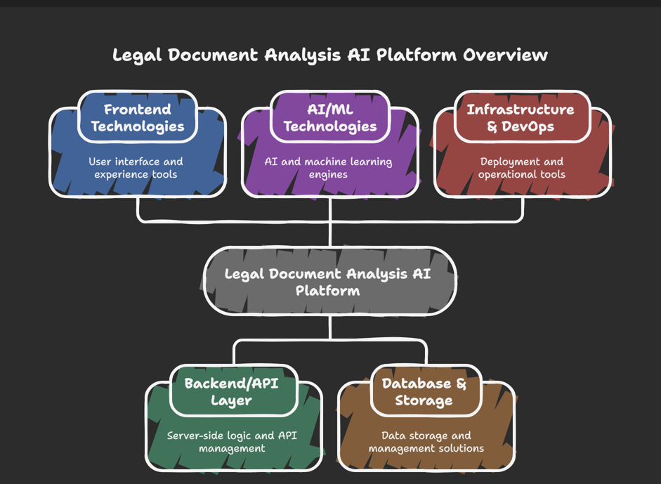
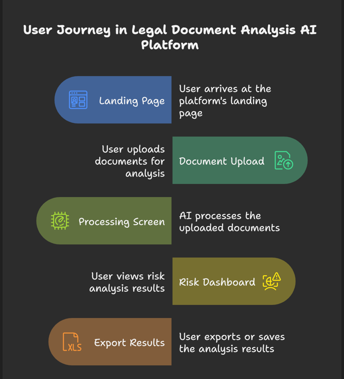

# Legal Document Analysis AI Platform

> Transform your legal workflow with AI-powered document analysis, multi-language support, and expert legal network integration.

[](https://your-demo-url.lovable.app)
[](./LICENSE)
[](https://reactjs.org/)
[](https://www.typescriptlang.org/)

<p align="center">
  
</p>

## 🎯 Overview

The Legal Document Analysis AI Platform is a cutting-edge solution that leverages artificial intelligence to analyze legal documents, identify risks, and provide actionable insights. Built for legal professionals, businesses, and individuals who need fast, accurate document review without compromising on quality.

### 🌟 Key Highlights

- **AI-Powered Analysis**: Advanced NLP identifies key clauses, risks, and opportunities in seconds
- **Multi-Language Support**: Analyze documents in English, Hindi (हिंदी), and Gujarati (ગુજરાતી)
- **Real-time Translation**: Automatic translation powered by Google Translate API
- **Risk Scoring**: Intelligent risk assessment with detailed breakdown
- **Expert Network**: Direct connection to qualified attorneys via Calendly
- **Bank-Level Security**: End-to-end encryption with automatic data deletion
- **Instant Results**: Comprehensive analysis in under 2 minutes

## ✨ Features

### Core Functionality

#### 🤖 AI Document Analysis
- **Gemini AI Integration**: Powered by Google's Gemini 2.0 Flash for accurate legal analysis
- **Risk Assessment**: Automated risk scoring (0-100 scale)
- **Clause Extraction**: Identifies critical clauses and obligations
- **Compliance Check**: Flags potential regulatory issues
- **Actionable Recommendations**: Provides specific guidance for improvement

#### 🌐 Multi-Language Support
- **Supported Languages**:
  - English (en)
  - Hindi - हिंदी (hi)
  - Gujarati - ગુજરાતી (gu)
- **Auto-Translation**: Documents automatically translated to English for analysis
- **Language Detection**: Smart detection of document language
- **Preserved Context**: Translation maintains legal terminology accuracy

#### 📊 Risk Dashboard
- **Visual Risk Breakdown**: Interactive charts showing risk distribution
- **Category Analysis**: Risks grouped by contract terms, compliance, financial impact
- **Severity Levels**: Color-coded risk indicators (High, Medium, Low)
- **Historical Tracking**: Monitor risk trends over time

<p align="center">
  
</p>

#### 📄 Document Management
- **Drag & Drop Upload**: Easy file upload interface
- **Supported Formats**: PDF, DOC, DOCX (up to 10MB)
- **Batch Processing**: Analyze multiple documents simultaneously
- **Secure Storage**: Temporary storage with automatic deletion post-analysis

#### 👨‍⚖️ Expert Consultation
- **Legal Expert Network**: Connect with qualified attorneys
- **Calendly Integration**: Easy scheduling at [calendly.com/msusimran20/30min](https://calendly.com/msusimran20/30min)
- **30-Minute Sessions**: Focused consultation for complex issues
- **Follow-up Support**: Ongoing guidance when needed

#### 🎥 Demo & Onboarding
- **Interactive Demo Video**: Learn platform features quickly
- **Step-by-Step Guides**: Comprehensive documentation
- **Video Tutorials**: Visual learning resources

### Security & Compliance

- ✅ **End-to-End Encryption**: All documents encrypted in transit and at rest
- ✅ **Auto-Deletion**: Files automatically removed after analysis
- ✅ **No Data Retention**: Zero storage of sensitive legal information
- ✅ **GDPR Compliant**: Follows data protection regulations
- ✅ **Secure API Integration**: Industry-standard authentication

<p align="center">
  
</p>

## 🛠️ Technology Stack

### Frontend
- **React 18.3.1**: Modern UI framework
- **TypeScript**: Type-safe development
- **Tailwind CSS**: Utility-first styling
- **Vite**: Fast build tool
- **Shadcn/ui**: Beautiful component library
- **Lucide Icons**: Clean, consistent iconography

### Backend & Services
- **Lovable Cloud**: Backend infrastructure
- **Supabase**: Database and authentication
- **Edge Functions**: Serverless backend logic

### AI & APIs
- **Google Gemini 2.0 Flash**: Document analysis
- **Google Translate API**: Multi-language support
- **Calendly API**: Expert scheduling

### Additional Libraries
- **Recharts**: Data visualization
- **React Hook Form**: Form management
- **Zod**: Schema validation
- **TanStack Query**: Data fetching

## 🚀 Getting Started

### Prerequisites

- Node.js 18+ or Bun
- npm, yarn, or bun package manager
- Google Gemini API Key
- Google Translate API Key

### Installation

1. **Clone the repository**
```bash
git clone https://github.com/SimranShaikh20/LegalAI-Document-Assistant.git
cd legal-document-analysis-ai
```

2. **Install dependencies**
```bash
npm install
# or
bun install
```

3. **Set up environment variables**

The project uses Lovable Cloud for backend services. Environment variables are automatically configured:
- `VITE_SUPABASE_URL`
- `VITE_SUPABASE_PUBLISHABLE_KEY`
- `VITE_SUPABASE_PROJECT_ID`

4. **Configure API Keys**

Add the following secrets via Lovable Cloud dashboard:
- `GEMINI_API_KEY`: Your Google Gemini API key
- `GOOGLE_TRANSLATE_API_KEY`: Your Google Translate API key

To obtain API keys:
- **Gemini API**: Visit [Google AI Studio](https://makersuite.google.com/app/apikey)
- **Google Translate**: Visit [Google Cloud Console](https://console.cloud.google.com/apis/credentials)

5. **Run the development server**
```bash
npm run dev
# or
bun run dev
```

6. **Open your browser**
Navigate to `http://localhost:8080`

## 📖 Usage Guide

### Uploading Documents

1. **Select Language**: Choose document language (English, Hindi, or Gujarati)
2. **Upload File**: Drag and drop or click to browse
3. **Review Files**: Check uploaded documents list
4. **Start Analysis**: Click "Start AI Analysis" button

<p align="center">
  
</p>

### Understanding Analysis Results

The analysis provides:
- **Overall Risk Score**: 0-100 scale (higher = more risk)
- **Executive Summary**: Brief overview of findings
- **Key Findings**: Major concerns identified
- **Compliance Issues**: Regulatory red flags
- **Recommendations**: Actionable next steps

### Risk Score Interpretation

- **🟢 0-30: Low Risk** - Minimal legal concerns
- **🟡 31-70: Medium Risk** - Review recommended  
- **🔴 71-100: High Risk** - Immediate attention required

### Consulting Experts

1. Click **"Consult Legal Expert"** button
2. You'll be redirected to Calendly scheduling page
3. Choose available time slot
4. Receive confirmation and meeting details

## 📁 Project Structure

```
legal-doc-analysis/
├── src/
│   ├── components/
│   │   ├── ui/              # Shadcn UI components
│   │   ├── Hero.tsx         # Landing hero section
│   │   ├── Features.tsx     # Features showcase
│   │   ├── DemoVideo.tsx    # Demo video section
│   │   ├── DocumentUpload.tsx  # Upload interface
│   │   └── RiskDashboard.tsx   # Risk visualization
│   ├── pages/
│   │   ├── Index.tsx        # Main landing page
│   │   └── NotFound.tsx     # 404 page
│   ├── integrations/
│   │   └── supabase/        # Supabase client config
│   ├── hooks/               # Custom React hooks
│   ├── lib/                 # Utility functions
│   └── index.css            # Global styles
├── supabase/
│   ├── functions/
│   │   └── analyze-document/  # Edge function for AI analysis
│   └── config.toml          # Supabase configuration
├── docs/                    # Documentation files
├── images/                  # Screenshots and assets
├── public/                  # Static assets
└── README.md
```

## 🔧 API Documentation

### Edge Functions

#### `analyze-document`

Analyzes legal documents using Gemini AI with optional translation.

**Endpoint**: `/functions/v1/analyze-document`

**Request Body**:
```json
{
  "documentText": "string",
  "fileName": "string",
  "language": "en|hi|gu"
}
```

**Response**:
```json
{
  "overallRiskScore": 75,
  "executiveSummary": "High-risk contract with several concerning clauses...",
  "keyFindings": [
    "Indemnification clause heavily favors counterparty",
    "Termination provisions lack mutual reciprocity"
  ],
  "complianceIssues": [
    "Payment terms exceed industry standard"
  ],
  "recommendations": [
    "Negotiate liability limitations",
    "Add mutual termination rights"
  ]
}
```

For complete API documentation, see [docs/API_DOCUMENTATION.md](./docs/API_DOCUMENTATION.md)

## 📚 Documentation

- [Project Overview](./docs/PROJECT_OVERVIEW.md)
- [Technical Documentation](./docs/TECHNICAL_DOCUMENTATION.md)
- [Features Guide](./docs/FEATURES_GUIDE.md)
- [User Guide](./docs/USER_GUIDE.md)
- [API Documentation](./docs/API_DOCUMENTATION.md)
- [Presentation Slides](./docs/PRESENTATION_SLIDES.md)

## 🎨 Design System

The platform uses a comprehensive design system with:
- **Color Tokens**: Semantic color variables for theming
- **Typography**: Consistent font hierarchy
- **Spacing**: Standard spacing scale
- **Animations**: Smooth transitions and effects
- **Components**: Reusable UI components

See design tokens in `src/index.css` and `tailwind.config.ts`

## 🔐 Security

### Data Protection
- All API calls use HTTPS
- Documents encrypted at rest
- Automatic deletion after analysis
- No long-term data storage
- Secure API key management via Supabase secrets

### API Security
- CORS protection enabled
- Rate limiting on edge functions
- Input validation and sanitization
- Error handling without data leakage

## 🧪 Testing

### Available Scripts
```bash
npm run dev          # Start development server
npm run build        # Build for production
npm run preview      # Preview production build
npm run lint         # Run ESLint
```

### Manual Testing Checklist
- [ ] Upload PDF document
- [ ] Upload DOC/DOCX document
- [ ] Test each language (EN, HI, GU)
- [ ] Verify analysis results
- [ ] Check Calendly integration
- [ ] Test responsive design
- [ ] Validate error handling

## 🚀 Deployment

### Using Lovable

1. Click **Publish** button (top right on desktop)
2. Your app will be deployed automatically
3. Receive deployment URL

### Custom Domain

1. Navigate to Project → Settings → Domains
2. Add your custom domain
3. Configure DNS settings
4. SSL certificate auto-provisioned

### Environment Configuration

All secrets are managed via Lovable Cloud:
- Navigate to Cloud → Edge Functions
- Configure required secrets
- Secrets automatically available to edge functions

## 🤝 Contributing

We welcome contributions! Please follow these steps:

1. Fork the repository
2. Create a feature branch (`git checkout -b feature/AmazingFeature`)
3. Commit changes (`git commit -m 'Add AmazingFeature'`)
4. Push to branch (`git push origin feature/AmazingFeature`)
5. Open a Pull Request

### Development Guidelines
- Follow TypeScript best practices
- Use semantic commit messages
- Add tests for new features
- Update documentation
- Maintain design system consistency

## 📄 License

This project is licensed under the MIT License - see the [LICENSE](./LICENSE) file for details.

Copyright (c) 2025 Simran Shaikh

## 👥 Team

**Simran Shaikh**
- Developer & Creator
- [msusimran20@gmail.com](mailto:msusimran20@gmail.com)
- [Schedule Consultation](https://calendly.com/msusimran20/30min)

## 🙏 Acknowledgments

- **Google Gemini**: AI analysis engine
- **Google Translate**: Multi-language support
- **Shadcn/ui**: Component library
- **Lovable**: Development platform
- **Supabase**: Backend infrastructure

## 📞 Support

### Get Help
- 📧 Email: msusimran20@gmail.com
- 📅 Schedule Call: [Book 30-min consultation](https://calendly.com/msusimran20/30min)
- 📚 Documentation: Check `/docs` folder
- 🐛 Report Issues: GitHub Issues

### FAQ

**Q: What file formats are supported?**
A: PDF, DOC, and DOCX files up to 10MB.

**Q: How long does analysis take?**
A: Typically under 2 minutes per document.

**Q: Is my data secure?**
A: Yes, all documents are encrypted and automatically deleted after analysis.

**Q: Can I analyze documents in other languages?**
A: Currently supports English, Hindi, and Gujarati. More languages coming soon.

**Q: Do I need legal expertise to use this?**
A: No, the platform is designed for all users. Expert consultation available when needed.

## 🌟 Business Value

### Key Benefits
- **80% Time Reduction** in initial document review
- **Consistent Analysis** across all documents
- **Risk Mitigation** through early issue identification
- **Cost Efficiency** through automation
- **Scalable Processing** for high-volume workflows

### Market Impact
- **$23B** Total addressable market in legal technology
- **180,000+** Law firms in the US market
- **75,000+** Corporate legal departments
- **85%** of legal professionals report document review bottlenecks

## 🗺️ Roadmap

### Q1 2025
- [ ] Add more language support (Spanish, French, German)
- [ ] Batch document comparison
- [ ] Export analysis reports (PDF/DOCX)
- [ ] Team collaboration features

### Q2 2025
- [ ] Mobile app (iOS/Android)
- [ ] Advanced analytics dashboard
- [ ] Template library
- [ ] Custom risk scoring rules

### Future
- [ ] Contract generation
- [ ] Version comparison
- [ ] AI-powered negotiation suggestions
- [ ] Integration with legal management systems

---

<p align="center">
  <strong>Built with ❤️ using Lovable, React, and AI</strong><br>
  <em>Delivering 80% time savings, consistent accuracy, and comprehensive risk insights</em>
</p>

<p align="center">
  For more information, visit our <a href="./docs/">documentation</a> or <a href="https://calendly.com/msusimran20/30min">schedule a demo</a>.
</p>
